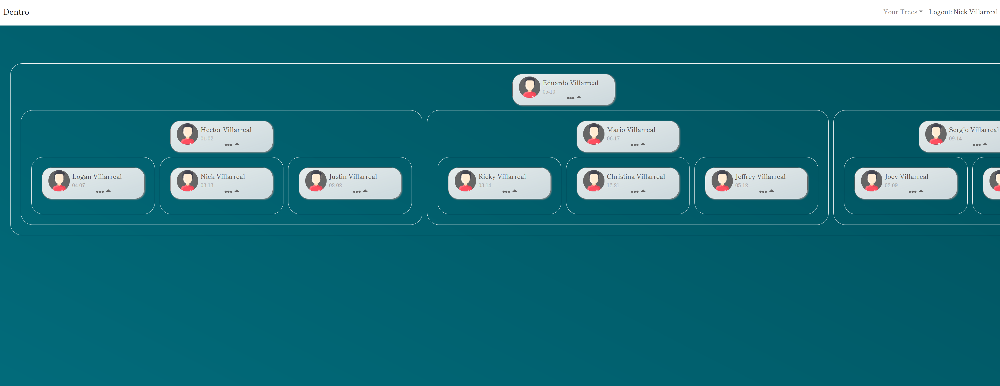

<p align="center">
  
</p>

# Dentro

Dentro is a website where you can visualize your family tree. Add multiple families, keep track of everyone's birthdays, and show off the size of your family!

## Screenshots

<p align="center">
  
</p>

## Getting started

1. Clone the repo

```
git clone https://github.com/Villux-NV/dentro.git
```

2. Install dependencies for server and client

```
cd client
npm install
```

```
cd server
npm install
```

3. Start servers for server and client

```
cd client
npm start
```

```
cd server
npm start
```

## Tech Stack

- [React](https://reactjs.org/) - Front end library for building user interfaces
- [Sequelize](https://sequelize.org/) - Promise-based Node.js ORM for Postgres
- [Postgres](https://www.postgresql.org/) - Open source object-relational database
- [Firebase](https://firebase.google.com/) - Auth - Authenticate and manage users
- [FramerMotion](https://www.framer.com/motion/) - Production-ready motion library for React

## Future

This project is still being improved upon. Any recommendations are welcome!

- Connect with Family - Share tree with everyone included
- Calendar - Share events with everyone connected
- Mobile friendly - Take your family and show off to everyone!

## Author

Nick Villarreal - [Github](https://github.com/Villux-NV) - [LinkedIn](https://www.linkedin.com/in/nick-villarreal-b2868957/)

## License

This project is licensed under the MIT License.
